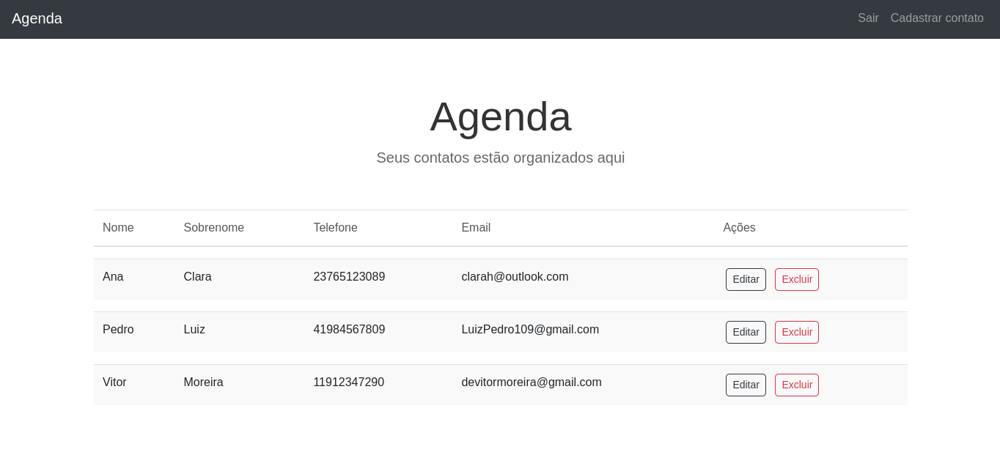
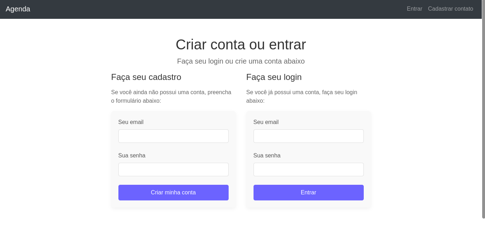

# Agenda

## Descrição

**Agenda** é um aplicativo web desenvolvido para gerenciar contatos de maneira eficiente, oferecendo uma interface intuitiva e funcional. O principal objetivo do projeto é permitir que os usuários criem, editem e visualizem contatos de forma simples, garantindo segurança e privacidade. Construído seguindo a arquitetura **MVC** (Model-View-Controller), o projeto garante organização, modularidade e fácil manutenção, facilitando a expansão e atualização da aplicação.

## Tecnologias Utilizadas

&nbsp;
&nbsp;
&nbsp;
&nbsp;
&nbsp;
&nbsp;
&nbsp;
&nbsp;
&nbsp;

## Características

- **Segurança Avançada**:

  - Implementação de **CSRF (Cross-Site Request Forgery)** para prevenir ataques de falsificação de requisições.
  - Uso de **Helmet** para configuração segura dos cabeçalhos HTTP, protegendo contra vulnerabilidades comuns.
  - Hash de senhas com **Bcryptjs**, garantindo armazenamento seguro das credenciais dos usuários.
  - Gerenciamento seguro de **cookies** para manter sessões de usuário protegidas.

- **Banco de Dados NoSQL**:

  - O **MongoDB** é usado para armazenar e gerenciar os dados dos contatos de forma escalável e flexível.

- **Validação de Formulários**:

  - Sistema de validação de entradas do usuário para garantir a integridade e segurança dos dados.

- **Renderização Dinâmica**:

  - Com **EJS**, as páginas são renderizadas dinamicamente no servidor, permitindo atualizações em tempo real e uma interface interativa.

- **Controle de Versão com Git**:

  - Todo o desenvolvimento é versionado com **Git**, garantindo histórico e controle total das alterações realizadas.

- **Performance**:

  - O uso de **Webpack** para empacotamento e minificação do código garante um carregamento rápido e eficiente da aplicação.

- **Responsividade**:

  - A interface é desenvolvida com **CSS** e **Bootstrap**, garantindo que a aplicação se adapte a diferentes dispositivos e tamanhos de tela, proporcionando uma experiência consistente em desktops, tablets e smartphones.

- **Facilidade de Manutenção**:
  - A aplicação segue um padrão modular com a arquitetura **MVC**, facilitando a manutenção, expansão e testes do sistema.

## Imagens do projeto

## Como Executar o Projeto

1. Clone o repositório para o seu computador: git clone https://github.com/DEVitor0/projeto-agenda.git
2. Navegue até a pasta do projeto: cd projeto-agenda
3. Instale as dependências necessárias: npm install
4. Inicie o servidor: npm start
5. Abra o navegador e acesse: `http://localhost:3000`

## Autor

Vitor Moreira
